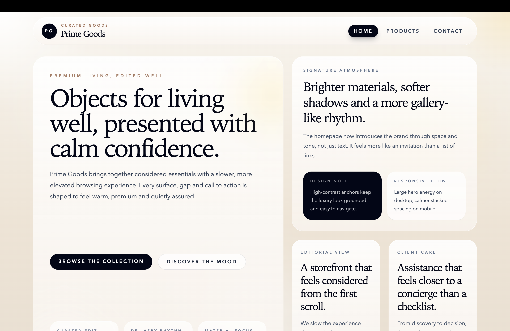
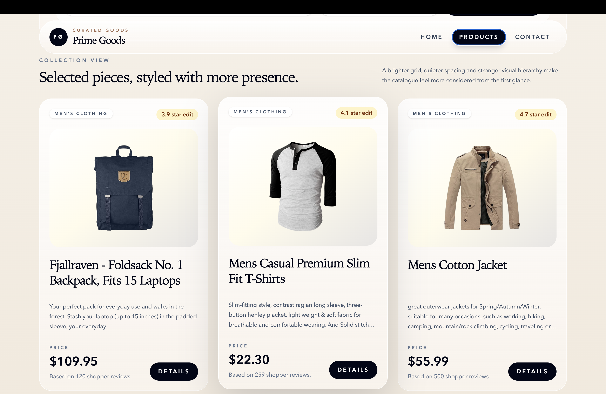
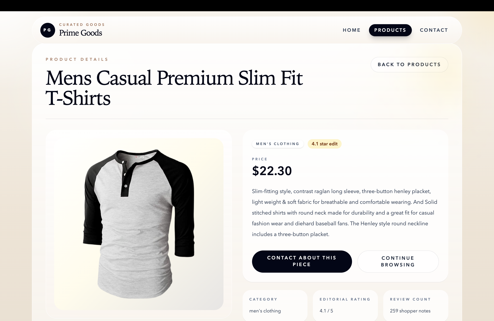
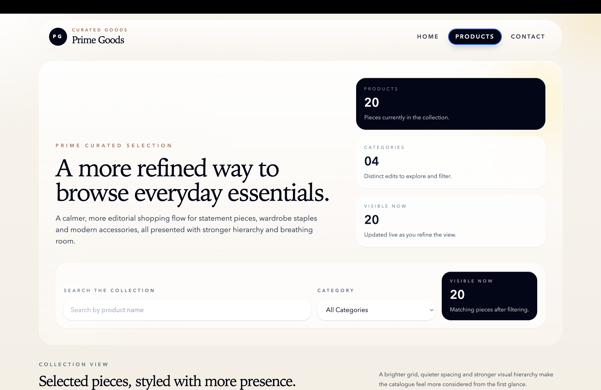
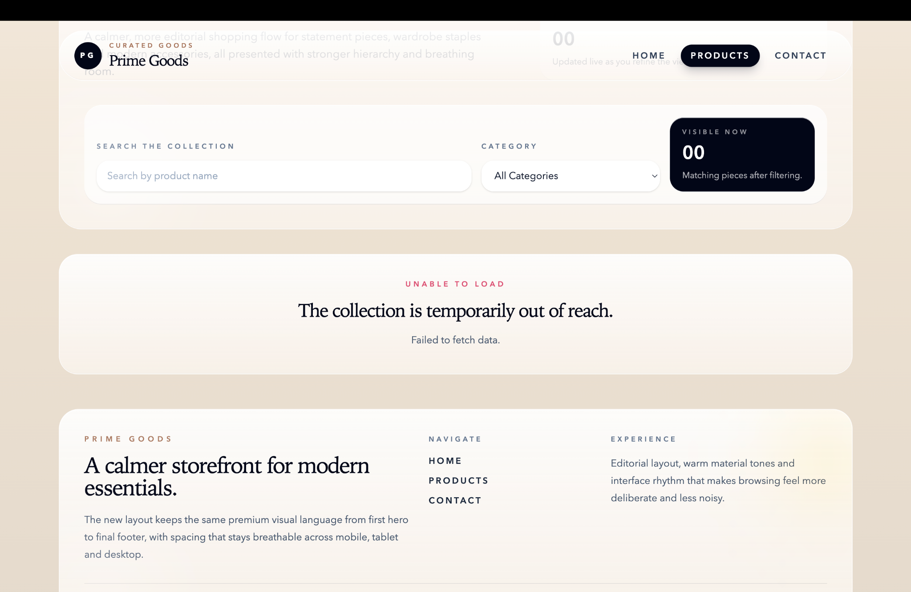

# PrimeGoods

PrimeGoods is a modern product showcase web application built with React and Tailwind CSS.  
The project focuses on clean UI, API integration, responsive design and a polished shopping-browsing experience.

## Live Demo

https://prime-goods-shop.netlify.app/

## Screenshots

### Home Page

### Products Overview

### Product Details

### Filtering & Search

### Error State

## About the Project

PrimeGoods is a frontend web app that displays products from an external API.  
Users can browse products, filter the collection, search by product name and view detailed product pages.

The goal of this project was to practice building a realistic React application with a clean structure, reusable components and professional UI/UX states.

## Features

- Product overview page
- Product detail page
- Live search by product name
- Category filtering
- Responsive layout
- Loading state
- Error state
- Empty/filter result state
- Contact page
- Reusable components
- React Router navigation
- External API integration

## Tech Stack

- React
- React Router
- Tailwind CSS
- JavaScript
- Vite
- Fake Store API
- Netlify

## API

This project uses the Fake Store API:

https://fakestoreapi.com/products

Used endpoints:

GET /products  
GET /products/:id

## Project Structure

src/
components/
layouts/
services/
App.jsx
main.jsx

## Future Improvements

- Add retry button on error state
- Refactor filtering logic with useMemo
- Add sorting
- Add skeleton loaders
- Add shopping cart
- Replace API with FastAPI backend

## Installation

git clone https://github.com/Bennyam/prime-goods.git
cd prime-goods  
npm install  
npm run dev

## Build

npm run build

## Author

Built by Ben Ameryckx
